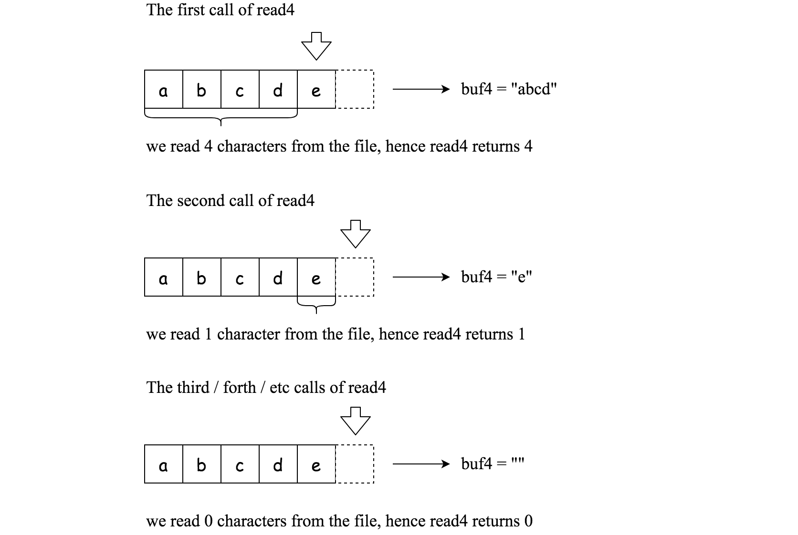

### Leetcode 158. Read N Characters Given Read4 II - Call multiple times

[Leetcode Subscribed Problem](https://leetcode.com/problems/read-n-characters-given-read4-ii-call-multiple-times/)

---

Given a `file` and assume that you can only read the file using a given method `read4`, implement a method to read `n`
characters.

Method read4:

The API `read4` reads four consecutive characters from `file`, then writes those characters into the buffer
array `buf4`.

The return value is the number of actual characters read.

Note that `read4()` has its own file pointer, much like `FILE *fp` in C.

Definition of read4:

```
    Parameter:  char[] buf4
    Returns:    int
buf4[] is a destination, not a source. The results from read4 will be copied to buf4[].

```

Below is a high-level example of how `read4` works:



```
File file("abcde"); // File is "abcde", initially file pointer (fp) points to 'a'
char[] buf4 = new char[4]; // Create buffer with enough space to store characters
read4(buf4); // read4 returns 4. Now buf4 = "abcd", fp points to 'e'
read4(buf4); // read4 returns 1. Now buf4 = "e", fp points to end of file
read4(buf4); // read4 returns 0. Now buf4 = "", fp points to end of file
```

**Method read:**

By using the `read4` method, implement the method `read` that reads *n* characters from the file and store it in the
buffer array `buf`. Consider that you cannot manipulate the file directly.

The return value is the number of actual characters read.

**Definition of read:**

```
    Parameters:	char[] buf, int n
    Returns:	int

Note: buf[] is destination not source, you will need to write the results to buf[]
```

Note:

- Consider that you cannot manipulate the file directly. The file is only accessible for `read4` but not for `read`.
- The read function may be **called multiple times**.
- Please remember to **RESET** your class variables declared in Solution, as static/class variables are persisted across
  multiple test cases. Please see [here](https://leetcode.com/faq/) for more details.
- You may assume the destination buffer array, `buf`, is guaranteed to have enough space for storing `n` characters.
- It is guaranteed that in a given test case the same buffer `buf` is called by `read`.

**Example 1:**

```
Input: file = "abc", queries = [1,2,1]
Output: [1,2,0]
Explanation: The test case represents the following scenario:
File file("abc");
Solution sol;
sol.read(buf, 1); // After calling your read method, buf should contain "a". We read a total of 1 character from the file, so return 1.
sol.read(buf, 2); // Now buf should contain "bc". We read a total of 2 characters from the file, so return 2.
sol.read(buf, 1); // We have reached the end of file, no more characters can be read. So return 0.
Assume buf is allocated and guaranteed to have enough space for storing all characters from the file.
```

**Example 2:**

```
Input: file = "abc", queries = [4,1]
Output: [3,0]
Explanation: The test case represents the following scenario:
File file("abc");
Solution sol;
sol.read(buf, 4); // After calling your read method, buf should contain "abc". We read a total of 3 characters from the file, so return 3.
sol.read(buf, 1); // We have reached the end of file, no more characters can be read. So return 0.
```

**Constraints:**

- `1 <= file.length <= 500`
- file consist of English letters and digits.
- `1 <= queries.length <= 10`
- `1 <= queries[i] <= 500`
