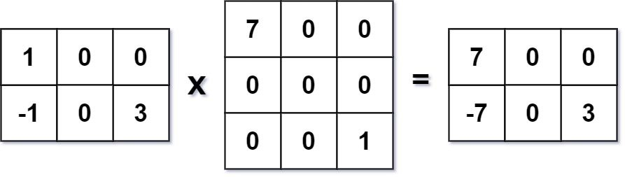

### Leetcode 311. Sparse Matrix Multiplication

[Leetcode Subscribed Problem](https://leetcode.com/problems/sparse-matrix-multiplication/)

---

Given two [sparse matrices](https://en.wikipedia.org/wiki/Sparse_matrix) `mat1` of size m x k and `mat2` of size k x n,
return the result of `mat1 x mat2`. You may assume that multiplication is always possible.

**Example 1:**




```
Input: mat1 = [[1,0,0],[-1,0,3]], mat2 = [[7,0,0],[0,0,0],[0,0,1]]
Output: [[7,0,0],[-7,0,3]]
```

**Example 2:**

```
Input: mat1 = [[0]], mat2 = [[0]]
Output: [[0]]
```

**Constraints:**

- `m == mat1.length`
- `k == mat1[i].length == mat2.length`
- `n == mat2[i].length`
- `1 <= m, n, k <= 100`
- `-100 <= mat1[i][j], mat2[i][j] <= 100`

